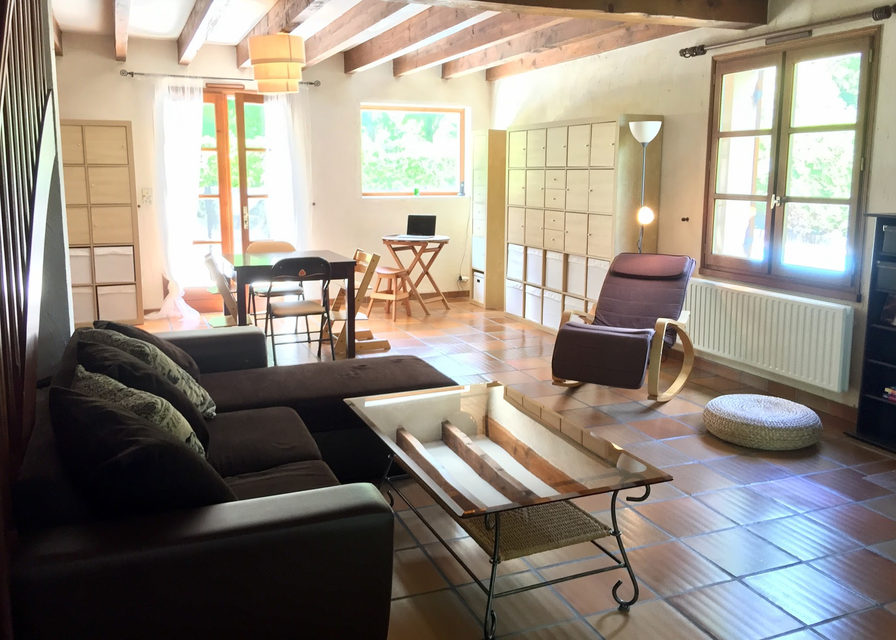

# Living in the house

* the beams can crack with the variations of temperature. This can be surprising, but quite normal!
* The osmosis unit filters the water after each use of the small faucet to fill its tank, and the softener is triggered alone \(daytime only\) for the filtration of water from the house. You may hear sounds of running water. This is also normal.
* When leaving the house, remember to check the closing of all doors and windows.
* As the window of the living room overlooks the pool, do not hesitate to use the security guard.
* In order to keep the freshness of the house as much as possible, we recommend lowering the awning and leaving the shutters of the doors and windows open during hot days..
* The pool is heated to 29 ° C by a heat pump that triggers at the same time as filtration. Covering the pool with the bubble cover at night will maintain a good temperature for swimming, but be sure not to **leave the indoor pool open during the day.**
* The beach road is often used at the beginning of the day. Feel free to enjoy the terrace and the pool and to stagger your outings to avoid busy periods.
* Household waste: the garbage bin \(green lid\) is collected on Monday and Thursday, the sorting bin \(yellow lid\) is collected on Wednesday. A glass collection point is accessible at 200 m approx. right out of the house along the Ribot Park.

