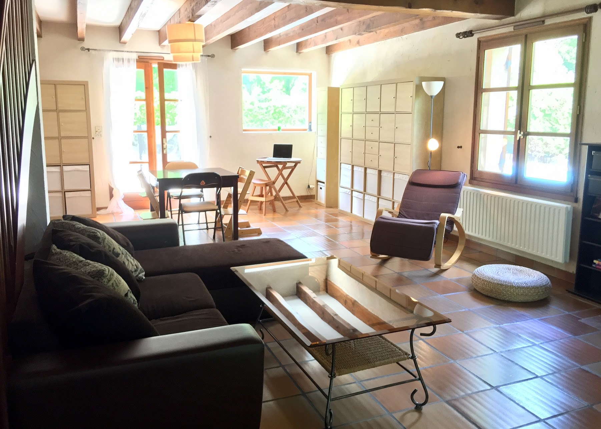

# Vie dans la maison

* les poutres peuvent craquer avec les variations de température. Cela peut être surprenant, mais tout à fait normal !
* L'osmoseur filtre l'eau après chaque utilisation du petit robinet pour remplir son réservoir, et l'adoucisseur se déclenche seul \(en journée uniquement\) pour la filtration de l'eau de la maison. Vous entendrez peut-être alors des bruits d'eau qui coule. Cela est normal.
* Lorsque vous quittez la maison, pensez à vérifier la fermeture de toutes les portes et fenêtres.
* La fenêtre du salon donnant sur la piscine, n'hésitez pas à utiliser l’entrebâilleur sécurisé.
* Afin de conserver au maximum la fraîcheur de la maison, nous vous conseillons d'abaisser le store, et de laisser les volets des portes et fenêtres entre-ouverts les jours de forte chaleur.
* La piscine est chauffée par une pompe à chaleur qui se déclenche en même temps que la filtration. Couvrir la piscine avec la bâche à bulles la nuit permet de conserver une bonne température pour la baignade, mais veillez à **ne pas laisser la piscine couverte en journée.**  
_en cas de souci quelconque, n'hésitez pas à le faire savoir avant la fin de votre séjour !_
* La route des plages est souvent fréquentée en début de journée. N’hésitez pas à profiter de la terrasse et de la piscine et à décaler vos sorties pour éviter les périodes d'affluence.
* **Déchets ménagers**: la poubelle tout déchet (couvercle vert) est collectée le **lundi** et le **jeudi**, la poubelle de tri sélectif (couvercle jaune) est collectée le mercredi. Un point de collecte du verre est accessible à 200 m env. à droite en sortant de la maison le long du parc de Ribot.
