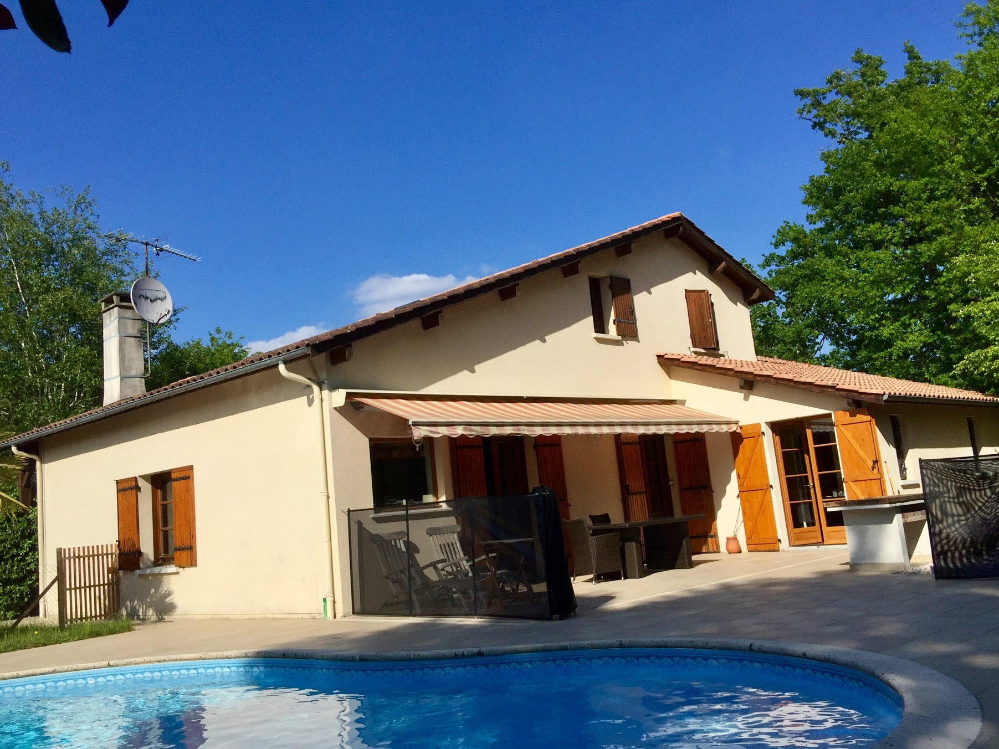

# La maison

----------
Traditionnelle de type landaise avec terrasse orientée  **sud/sud-ouest**  et jardin sur un terrain clos de 1000m2.

*Composition et équipement:*

### RDC
----------
  - chambre adulte: 13,3M2
    - 1 lit double (clic-clac)
    - 1 commode-table à langer
    - chambre enfants: 12,5M2
	- 2 lits superposés
    - 1 lit simple
  - Salle d'eau:
	- douche
    - double-vasque
    - sèche-cheveux
  - WC séparé
  - Cuisine équipée avec accès sur la terrasse
	 - lave-vaisselle
	 - four
	 - grille-pain
	 - plaque de cuisson (vitrocéramique)
	 - micro-ondes
	 - bouilloire
	 - cafetière
	 - eau osmosée  (robinet proche de l'évier)
  - Salon / Salle à manger: 50m2
	- Canapé-lit + table basse
	- télévision + barre de son
	- Freebox player + console de jeux (PS3)
	- table à manger de 4 à 8 convives
	- petite table ronde (coin bureau)
  - Buanderie
	- Machine à laver
    - Sèche-linge
    - Séchoir
    - Table à repasser + centrale vapeur
    - adoucisseur
  - Salle de sport
	- Tapis de course
	- Vélo elliptique

### Etage
----------
- Mezzanine
- Salle de bains
	 - douche
	 - baignoire
	 - WC
	 - double-vasque

### La piscine
----------
- Forme haricot 
	- Dimensions: 5X8M
	- Profondeurs: de 1,06M à 1,80M
	- Filtration:
	  - Granulés de verre
	  - électrolyseur au sel + Ph-mètre
	  - Deux transats avec table basse

### La terrasse
----------
- Table de jardin avec 6 fauteuils
-  2 chaises longues
- Store électrique
- Barbecue au charbon de bois